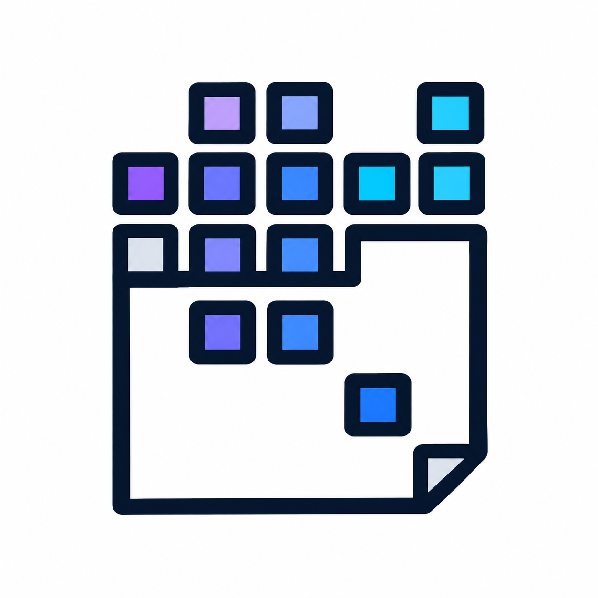

    

  

  
  

## 👋 About

I'm a developer who enjoys building practical software, experimenting with new technologies, and turning ideas into real projects.

| 🎯 **Focused On** | 🛠️ **Building** | 🔐 **Interested In** |
|:---:|:---:|:---:|
| Web Development | Personal Projects | Security & Encryption |
| Clean Code | Modern Web Tech | Software Architecture |

## 💻 Tech Stack

  
  
  
  
  
  
    
  
  
  
  
  

## 🚀 My Projects

  

    

  

## 🔨 What I Build

- 🌐 Web applications
- 🔐 Security and encryption tools
- 🤝 Collaborative development platforms
- 🗄️ Database-driven applications
- ⚙️ Developer tools
- 🧪 Experimental projects

## 📫 Connect With Me

  
  

  

